# Image Placeholder Options Survey

Captured on: 2026-08-03

This document summarizes common "preview while loading" techniques and links each technique to screenshots captured from real websites.

## Side-by-Side: Preview vs Fully Loaded

The sections below use only visuals where the source image itself clearly shows which content is real and which is placeholder.

### BlurHash example (from official BlurHash media)

Source website: https://github.com/woltapp/blurhash

The following two official images each include both states in one frame:
- Real image at the top
- Encoded hash text in the middle
- Decoded blurred placeholder at the bottom

| Official example A | Official example B |
|---|---|
| 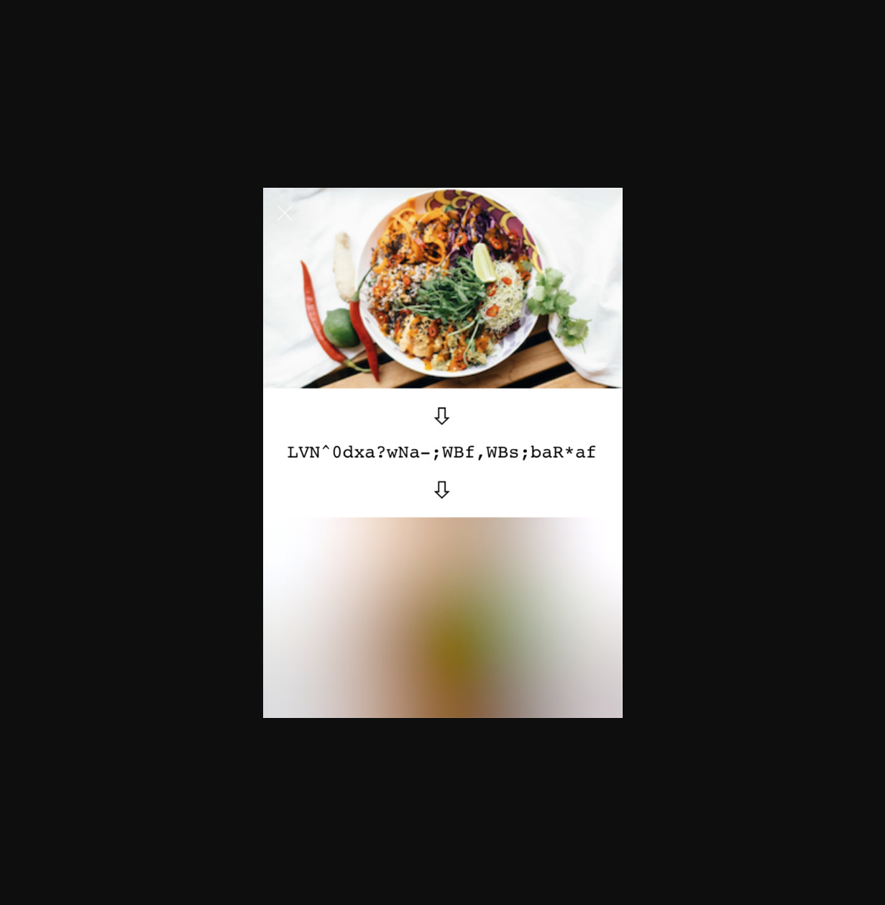 | 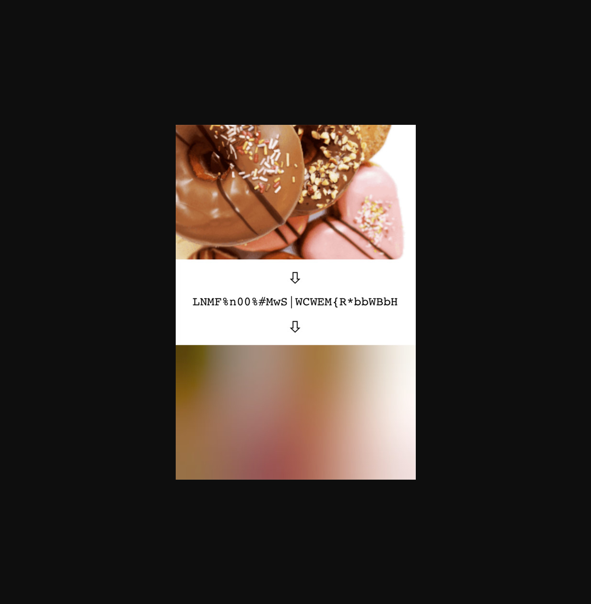 |

Combined reference image from same source:

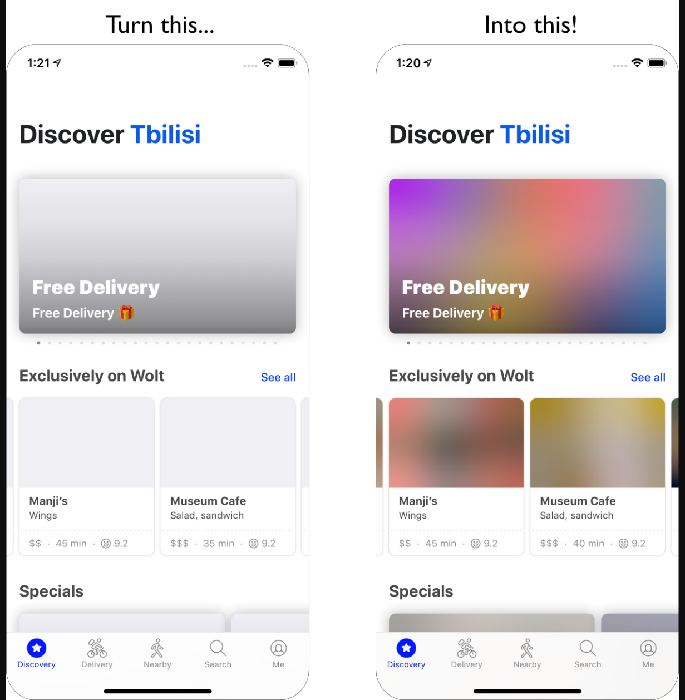

### ThumbHash example (from official ThumbHash demo)

Source website: https://evanw.github.io/thumbhash/

The official demo screenshot below contains labeled comparison columns, including:
- Original image
- ThumbHash
- BlurHash
- Average color

Full demo screenshot:

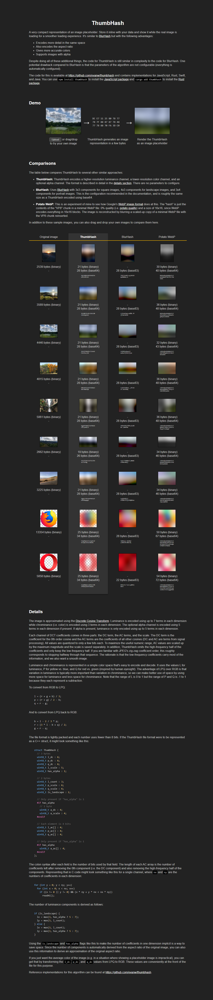

### Blur-up example (from Next.js image component demo)

Source website: https://image-component.nextjs.gallery/placeholder

This screenshot demonstrates the blur-up technique page itself:

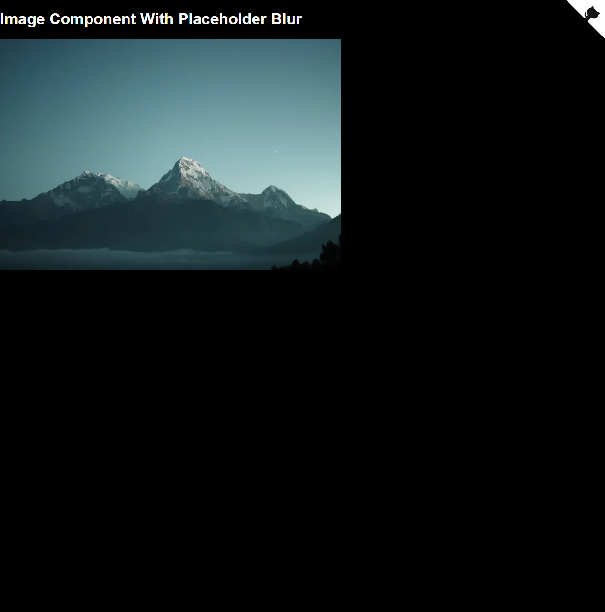

### Shimmer example (from official Next.js shimmer formula + official image asset)

Source website references:
- https://github.com/vercel/next.js/tree/canary/examples/image-component
- https://raw.githubusercontent.com/vercel/next.js/canary/examples/image-component/app/shimmer/page.tsx

The pair below is generated from the exact shimmer SVG placeholder formula and the same real image file used in the official example:

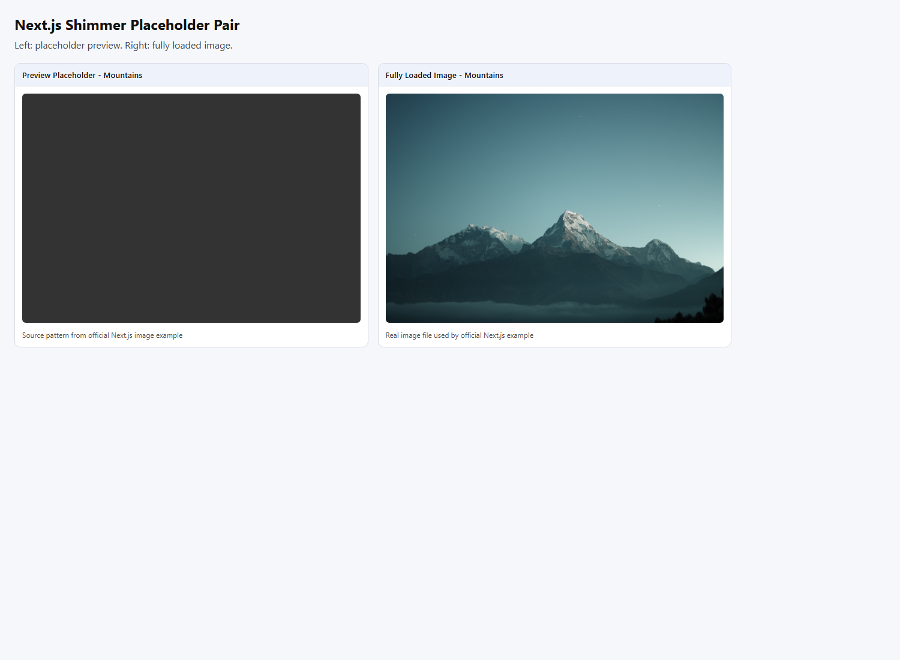

### Color placeholder example (from official Next.js color formula + official image assets)

Source website references:
- https://github.com/vercel/next.js/tree/canary/examples/image-component
- https://raw.githubusercontent.com/vercel/next.js/canary/examples/image-component/app/color/page.tsx

The pair below is generated from the exact RGB GIF placeholder formula and the same real Dog/Cat files used in the official example:

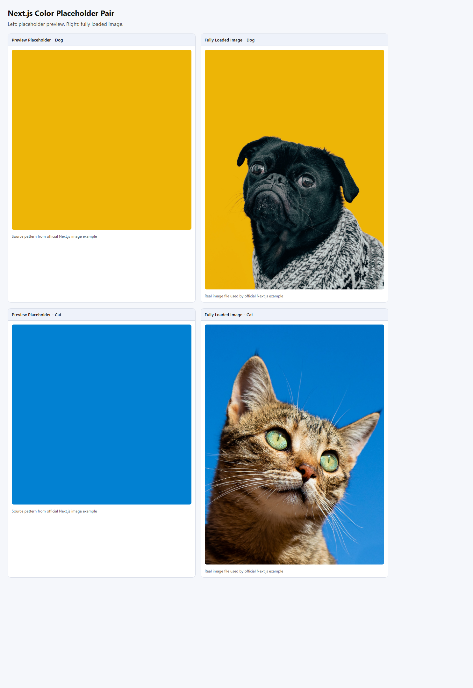

## Evidence Screenshots (Real Websites)

### 1) BlurHash (hash decoded to blurred bitmap)

Source website: https://github.com/woltapp/blurhash

Screenshot:

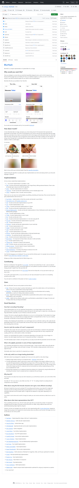

Notes:
- The BlurHash project page includes examples and implementation references for hash-based placeholders.
- Typical flow: store compact hash string, decode on client, then swap to full image.

Libraries:
- https://github.com/woltapp/blurhash
- https://www.npmjs.com/package/blurhash

### 2) ThumbHash (compact hash placeholder)

Source website: https://github.com/evanw/thumbhash

Screenshots:

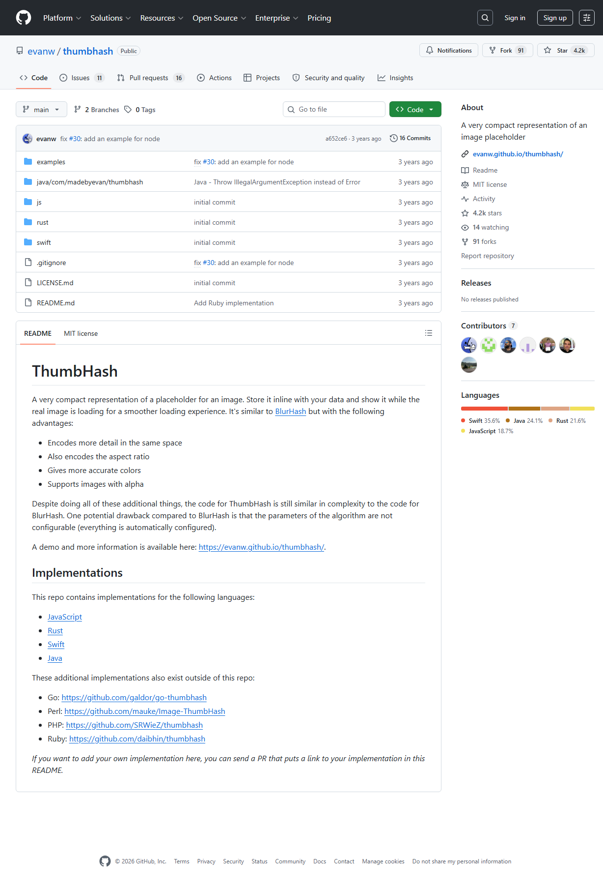

Notes:
- ThumbHash is a compact hash format optimized for preserving rough color/detail in tiny payloads.
- Similar usage model to BlurHash, but different encoding/decoding behavior and trade-offs.

Libraries:
- https://github.com/evanw/thumbhash
- https://www.npmjs.com/search?q=thumbhash

### 3) Blur-up placeholder (tiny image blurred while loading)

Source website: https://image-component.nextjs.gallery/placeholder

Screenshot:

Notes:
- Demonstrates blur-up behavior commonly used in production image pipelines.
- Usually implemented with tiny low-quality image data (for example Data URL) and CSS/image transitions.

Libraries/platforms:
- https://nextjs.org/docs/pages/api-reference/components/image
- https://github.com/vercel/next.js/tree/canary/examples/image-component
- https://www.gatsbyjs.com/docs/reference/built-in-components/gatsby-plugin-image/

### 4) Shimmer placeholder (skeleton-like loading visual)

Source website: https://image-component.nextjs.gallery/shimmer

Screenshot:

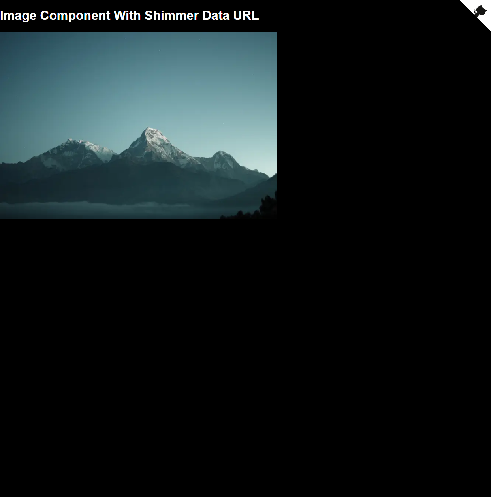

Notes:
- Shimmer placeholders prioritize perceived progress and layout stability.
- Common in feed and card-heavy interfaces.

Libraries:
- https://nextjs.org/docs/pages/api-reference/components/image
- https://www.npmjs.com/package/react-loading-skeleton

### 5) Color placeholder (dominant/average color block)

Source website: https://image-component.nextjs.gallery/color

Screenshot:

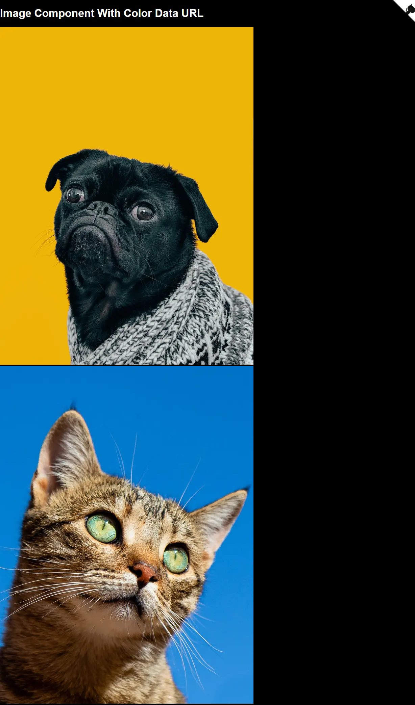

Notes:
- Very small payload and cheap to render.
- Often combined with blur-up or fade transitions.

Libraries/platforms:
- https://nextjs.org/docs/pages/api-reference/components/image
- https://www.npmjs.com/package/plaiceholder
- https://sharp.pixelplumbing.com/

### 6) Multi-technique demo hub

Source website: https://image-component.nextjs.gallery/

Screenshot:

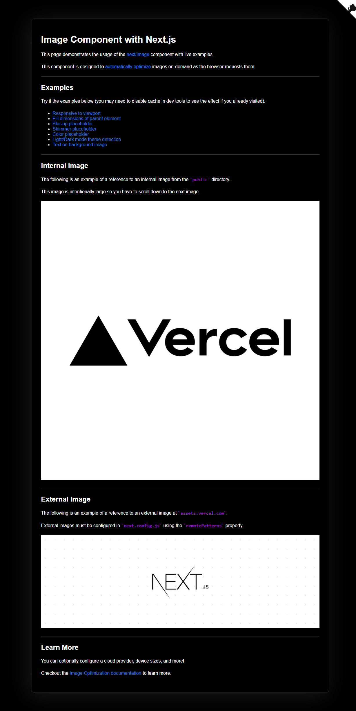

Notes:
- Useful reference hub showing multiple placeholder types in one real site.

## Option Summary Table

| Technique | Typical Payload | CPU Cost | Visual Fidelity | Common Use |
|---|---:|---:|---:|---|
| Dominant color | Very low | Very low | Low | Feeds, fast placeholders |
| Shimmer/skeleton | Low | Low | N/A (non-image) | Content-heavy UIs |
| Blur-up LQIP | Low to medium | Low | Medium to high | Most web apps |
| BlurHash | Very low (string) | Medium (decode) | Medium | API-driven apps |
| ThumbHash | Very low (string/binary) | Medium (decode) | Medium to high | API-driven apps |

## Practical Recommendation for This Repo

For your comparison lab, start with these five tracks:

1. BlurHash
2. ThumbHash
3. Blur-up LQIP
4. Color placeholder
5. Shimmer placeholder

These cover the most common production strategies and give a balanced comparison across bytes, quality, and runtime cost.
